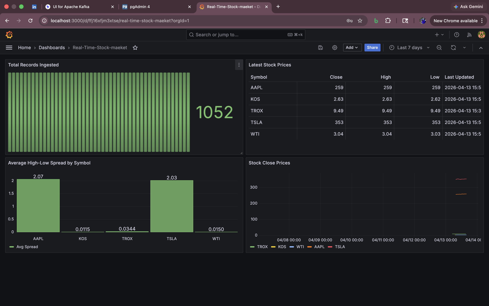

# Real-Time Stock Market Analysis Pipeline

## The Problem

Companies tracking stock market movements face a critical challenge: **no real-time visibility into stock price changes**. Traditional approaches rely on manual data collection — analysts pulling reports from financial platforms, copying data into spreadsheets, and building static charts that are outdated the moment they're created.

This creates three costly consequences:

1. **Delayed decision-making** — By the time data is collected, cleaned, and visualized, market conditions have already shifted. Opportunities are missed, and risk exposure goes unnoticed.
2. **Human error** — Manual data entry introduces inconsistencies. A mistyped decimal, a skipped time interval, or a forgotten symbol can distort analysis and lead to poor decisions.
3. **No scalability** — As the number of tracked symbols grows, the manual process breaks down. What works for 3 stocks fails at 50.

## The Solution

This project eliminates the manual bottleneck by building a **fully automated, real-time data pipeline** that continuously ingests stock market data, processes it through a streaming engine, stores it in a relational database, and visualizes it on a live dashboard — all running inside Docker containers with a single command.

### How It Works

```
Alpha Vantage API → Python Producer → Kafka → Spark Structured Streaming → PostgreSQL → Grafana
```


**Every 5 minutes**, the pipeline automatically:

1. **Ingests** — The Python producer fetches intraday stock data (open, high, low, close) from the Alpha Vantage API for each tracked symbol.
2. **Streams** — Data is published to an Apache Kafka topic (`stock_analysis`), decoupling the data source from downstream consumers.
3. **Processes** — Apache Spark Structured Streaming reads from Kafka in real time, parses the JSON payloads, casts data types, and writes microbatches to PostgreSQL via JDBC.
4. **Stores** — PostgreSQL persists all processed records with full history, enabling both real-time and historical analysis.
5. **Visualizes** — Grafana queries PostgreSQL and renders live dashboards showing closing prices, price spreads, latest quotes, and total records ingested.

### Business Impact

| Before | After |
|--------|-------|
| Manual data collection every few hours | Automated ingestion every 5 minutes |
| Static spreadsheets with stale data | Live dashboard with real-time updates |
| 3 stocks tracked manually | 5+ symbols with no additional effort |
| No historical trend visibility | Full time-series history stored in PostgreSQL |
| Error-prone manual entry | 100% automated with fault tolerance |

### Live Dashboard



## Architecture

### Services

| Service | Description | Port |
|---------|-------------|------|
| **Producer** | Fetches stock data from Alpha Vantage API every 5 minutes and publishes to Kafka | - |
| **Kafka** | Message broker using KRaft mode (no Zookeeper) | 9092 (internal), 9094 (external) |
| **Kafka UI** | Web UI for monitoring Kafka topics and messages | [localhost:8085](http://localhost:8085) |
| **Spark Master** | Coordinates Spark cluster | [localhost:8081](http://localhost:8081) |
| **Spark Worker** | Executes Spark jobs (2 cores, 2GB RAM) | - |
| **Consumer** | Spark Structured Streaming job that reads from Kafka and writes to PostgreSQL | - |
| **PostgreSQL** | Stores processed stock data (Debezium image with logical replication support) | 5434 |
| **pgAdmin** | Web UI for PostgreSQL management | [localhost:5050](http://localhost:5050) |
| **Grafana** | Real-time dashboard for stock data visualization | [localhost:3000](http://localhost:3000) |

## Tech Stack

- **Languages:** Python, SQL
- **Streaming:** Apache Kafka (KRaft mode), Apache Spark Structured Streaming
- **Database:** PostgreSQL 17
- **Containerization:** Docker, Docker Compose
- **Monitoring:** Grafana, Kafka UI, pgAdmin
- **API:** Alpha Vantage (via RapidAPI)

## Tracked Symbols

| Symbol | Company |
|--------|---------|
| AAPL | Apple Inc. |
| KOS | Kosmos Energy |
| TROX | Tronox Holdings |
| TSLA | Tesla Inc. |
| WTI | W&T Offshore |

---

## For Recruiters: How to Run This Project

Everything is containerized with Docker Compose. You don't need Python, Kafka, Spark, or PostgreSQL installed on your machine — just Docker.

### Prerequisites

- [Docker](https://docs.docker.com/get-docker/) and [Docker Compose](https://docs.docker.com/compose/install/) installed
- A free [RapidAPI](https://rapidapi.com/) account with access to the Alpha Vantage API

### Step 1: Clone the Repository

```bash
git clone https://github.com/CHARLESojini/Real-Time-Stock-Market-Analysis.git
cd Real-Time-Stock-Market-Analysis
```

### Step 2: Set Up Environment Variables

```bash
cp .env.example .env
```

Open the `.env` file and fill in your credentials:

```
RAPIDAPI_KEY=your_rapidapi_key_here
RAPIDAPI_HOST=alpha-vantage.p.rapidapi.com
POSTGRES_USER=your_username
POSTGRES_PASSWORD=your_password
KAFKA_BOOTSTRAP_SERVER=kafka:9092
```

### Step 3: Start the Entire Pipeline

```bash
docker compose up -d --build
```

This single command spins up all 9 services. The producer will begin fetching stock data automatically every 5 minutes.

### Step 4: Verify Everything Is Running

```bash
docker compose ps
```

All containers should show `running` status. Monitor the data flowing:

```bash
# Watch the producer fetch and send data
docker compose logs -f producer

# Watch the consumer process and write to PostgreSQL
docker compose logs -f consumer
```

### Step 5: Access the Dashboards

| Dashboard | URL | Credentials |
|-----------|-----|-------------|
| **Grafana** | [localhost:3000](http://localhost:3000) | admin / admin |
| **Kafka UI** | [localhost:8085](http://localhost:8085) | No login required |
| **pgAdmin** | [localhost:5050](http://localhost:5050) | admin@admin.com / admin |
| **Spark Master** | [localhost:8081](http://localhost:8081) | No login required |

### Step 6: Set Up the Grafana Dashboard (First Time Only)

1. Log into Grafana at [localhost:3000](http://localhost:3000)
2. Go to **Connections → Data Sources → Add data source → PostgreSQL**
3. Configure the connection:
   - Host: `postgres_db:5432`
   - Database: `stock_data`
   - User: your POSTGRES_USER from `.env`
   - Password: your POSTGRES_PASSWORD from `.env`
   - TLS/SSL Mode: disable
4. Click **Save & Test** — you should see "Database Connection OK"

### Step 7: Query the Data Directly

```bash
docker exec -it postgres_db psql -U your_username -d stock_data -c "SELECT * FROM stocks LIMIT 10;"
```

### Stopping the Pipeline

```bash
# Stop all containers (keeps data)
docker compose down

# Stop and delete all data
docker compose down -v
```

## Project Structure

```
Real-Time-Stock-Market-Analysis/
├── producer/
│   ├── Dockerfile
│   ├── requirements.txt
│   ├── config.py          # API configuration and logging
│   ├── extract.py         # API data extraction and transformation
│   ├── main.py            # Entry point with automated scheduling loop
│   └── producer_setup.py  # Kafka producer configuration
├── Consumer/
│   ├── Dockerfile
│   ├── config.py          # PostgreSQL and Kafka schema configuration
│   └── consumer.py        # Spark Structured Streaming job
├── compose.yml            # Docker Compose orchestration for all 9 services
├── .env.example           # Template for required environment variables
├── .gitignore
├── architecture.png       # Pipeline architecture diagram
└── README.md
```

## Author

**Chima Charles Ojini** — Data Engineer

- LinkedIn: [linkedin.com/in/charles-ojini](https://linkedin.com/in/charles-ojini/)
- GitHub: [github.com/CHARLESojini](https://github.com/CHARLESojini)
- Portfolio: [charlesojini.github.io/my-portfolio](https://charlesojini.github.io/my-portfolio/)
