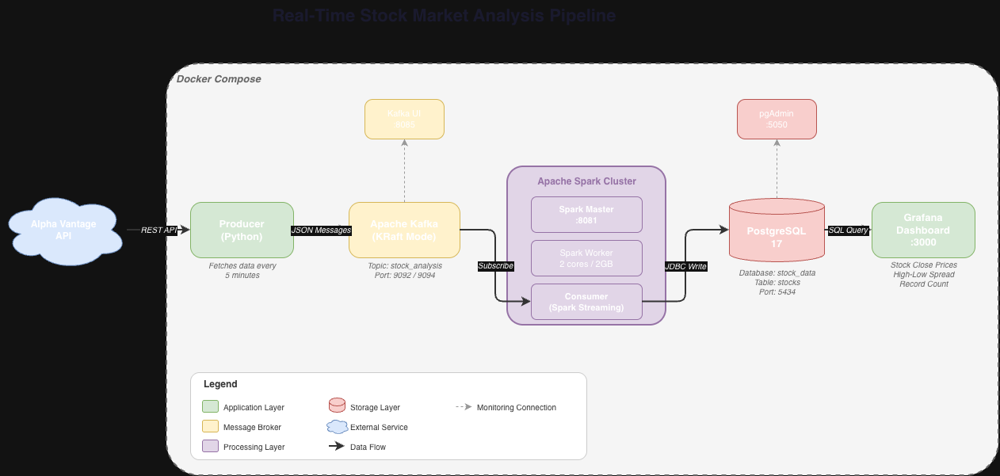

# Real-Time Stock Market Analysis Pipeline

A fully containerized real-time data pipeline that streams stock market data from the Alpha Vantage API through Apache Kafka and Apache Spark into PostgreSQL, with live monitoring via Grafana.

## Architecture

```

```

### Services

| Service | Description | Port |
|---------|-------------|------|
| **Producer** | Fetches stock data from Alpha Vantage API every 5 minutes and publishes to Kafka | - |
| **Kafka** | Message broker using KRaft mode (no Zookeeper) | 9092 (internal), 9094 (external) |
| **Kafka UI** | Web UI for monitoring Kafka topics and messages | [localhost:8085](http://localhost:8085) |
| **Spark Master** | Coordinates Spark cluster | [localhost:8081](http://localhost:8081) |
| **Spark Worker** | Executes Spark jobs (2 cores, 2GB RAM) | - |
| **Consumer** | Spark Structured Streaming job that reads from Kafka and writes to PostgreSQL | - |
| **PostgreSQL** | Stores processed stock data (Debezium image with logical replication support) | 5434 |
| **pgAdmin** | Web UI for PostgreSQL management | [localhost:5050](http://localhost:5050) |
| **Grafana** | Real-time dashboard for stock data visualization | [localhost:3000](http://localhost:3000) |

## Tech Stack

- **Languages:** Python, SQL
- **Streaming:** Apache Kafka (KRaft mode), Apache Spark Structured Streaming
- **Database:** PostgreSQL 17
- **Containerization:** Docker, Docker Compose
- **Monitoring:** Grafana, Kafka UI, pgAdmin
- **API:** Alpha Vantage (via RapidAPI)

## Prerequisites

- [Docker](https://docs.docker.com/get-docker/) and [Docker Compose](https://docs.docker.com/compose/install/) installed
- A free [RapidAPI](https://rapidapi.com/) account with access to the Alpha Vantage API

## Getting Started

### 1. Clone the repository

```bash
git clone https://github.com/CHARLESojini/Real-Time-Stock-Market-Analysis.git
cd Real-Time-Stock-Market-Analysis
```

### 2. Set up environment variables

```bash
cp .env.example .env
```

Open `.env` and fill in your actual credentials:

```
RAPIDAPI_KEY=your_rapidapi_key_here
RAPIDAPI_HOST=alpha-vantage.p.rapidapi.com
POSTGRES_USER=your_username
POSTGRES_PASSWORD=your_password
KAFKA_BOOTSTRAP_SERVER=kafka:9092
```

### 3. Start the pipeline

```bash
docker compose up -d --build
```

This single command spins up all 9 services. The producer will begin fetching stock data automatically every 5 minutes.

### 4. Verify the pipeline

Check that all containers are running:

```bash
docker compose ps
```

Monitor the producer logs:

```bash
docker compose logs -f producer
```

Monitor the consumer logs:

```bash
docker compose logs -f consumer
```

### 5. Access the dashboards

- **Grafana:** [localhost:3000](http://localhost:3000) (admin / admin)
- **Kafka UI:** [localhost:8085](http://localhost:8085)
- **pgAdmin:** [localhost:5050](http://localhost:5050) (admin@admin.com / admin)
- **Spark Master UI:** [localhost:8081](http://localhost:8081)

### 6. Set up Grafana (first time only)

1. Log into Grafana at [localhost:3000](http://localhost:3000)
2. Go to **Connections → Data Sources → Add data source → PostgreSQL**
3. Configure the connection:
   - Host: `postgres_db:5432`
   - Database: `stock_data`
   - User: your POSTGRES_USER from `.env`
   - Password: your POSTGRES_PASSWORD from `.env`
   - TLS/SSL Mode: disable
4. Click **Save & Test**

### 7. Query the data

Connect to PostgreSQL directly:

```bash
docker exec -it postgres_db psql -U your_username -d stock_data -c "SELECT * FROM stocks LIMIT 10;"
```

## Tracked Symbols

| Symbol | Company |
|--------|---------|
| KOS | Kosmos Energy |
| TROX | Tronox Holdings |
| WTI | W&T Offshore |

## Stopping the Pipeline

```bash
docker compose down
```

To stop and remove all data volumes:

```bash
docker compose down -v
```

## Project Structure

```
Real-Time-Stock-Market-Analysis/
├── producer/
│   ├── Dockerfile
│   ├── requirements.txt
│   ├── config.py
│   ├── extract.py
│   ├── main.py
│   └── producer_setup.py
├── Consumer/
│   ├── Dockerfile
│   ├── config.py
│   └── consumer.py
├── compose.yml
├── .env.example
├── .gitignore
└── README.md
```

## Author

**Chima Charles Ojini**
- LinkedIn: [linkedin.com/in/charles-ojini](https://linkedin.com/in/charles-ojini/)
- GitHub: [github.com/CHARLESojini](https://github.com/CHARLESojini)